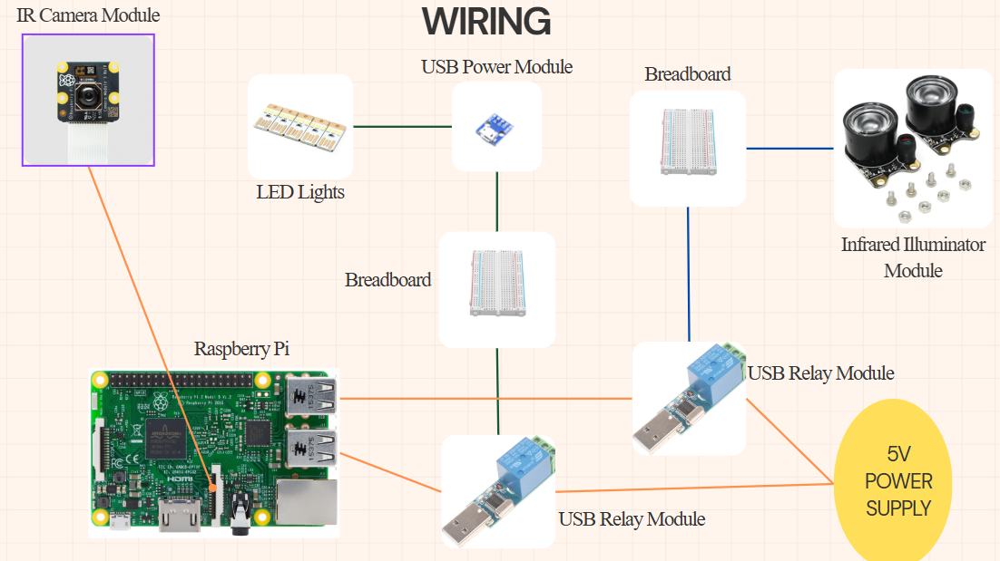

# Smart Night Lamp System using Raspberry Pi and MediaPipe
## Overview
This project designs a smart night lamp system that detects whether a person gets out of bed during night time using
vision-based pose estimation.
The system runs on Raspberry Pi and controls a USB LED via relay module.

## Motivation
Turning on lights manually at night can be inconvenient and unsafe.
This project explores a vision-based solution to detect "lying-to-standing" transitions automatically.

## System Architecture

IR Camera  
↓  
Pose Detection  
↓  
Decision Logic  
↓  
Relay Control

## Detection Logic
The system compares the normalized Y-coordinate of
the nose and hip landmarks.

If:
nose_y < hip_y - threshold

The system interprets it as standing up.

## Wiring

## Features
Night mode (00:00–06:00)
Pose-based activity detection
2-minute auto shutoff
USB relay control

## Tech Stack
Python, OpenCV, MediaPipe, PySerial, Raspberry Pi

## Limitations
- No hardware deployment testing
- Heuristic-based detection may cause false positives
- No multi-person support

